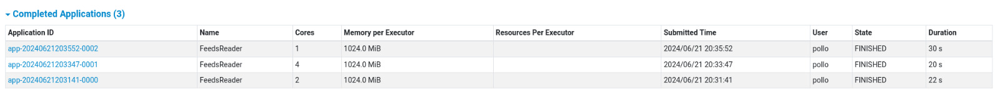

# Laboratorio de Programación Distribuida Grupo 30

Integrantes:

- Facundo Sharry
- Juan Cruz González
- Alejandro Pitt

El enunciado del laboratorio se encuentra en [este link](https://docs.google.com/document/d/e/2PACX-1vQn5BpCPQ6jKMN-sz46261Qot82KbDZ1RUx8jNzAN4kBEAq_i97T3R6ZA0_yRA5elN66e-EArXQXuAh/pub).

## 1. Tareas
Pueden usar esta checklist para indicar el avance.

### Verificación de que pueden hacer las cosas.
- [X] Descargar y probar crear master + slaves en spark

### 1.1. Guardar Articulos (Titulo + Descripcion) en un archivo
- [X] archivo txt

### 1.2. Distribuir el calculo en los hijos
- [X] aplicar heuristica en cada RDD
- [X] aplicar filtro de entidad nombrada en cada RDD  

## 2. Experiencia

# Testeo con BigData de Wikipedia(Provisto por medio de Zulip)
Logramos correr el programa con hasta 274 líneas particionando el archivo provisto, probamos con 1 worker, 2 workers y 4 workers. Los resultados fueron los mismos en cuanto a entidades nombradas encontradas y notamos una mejora en tiempo de ejecución con el aumento de workers. Este resultado fue el esperado, también suponemos que llegará un punto donde el costo de recolectar los resultados de los workers superará la ventaja de dividir el trabajo.
 

# Modificaciones respecto al Lab2
- En las clases tuvimos que hacer varias modificaciones a nuestras clases. Para empezar modificamos EntityParser responsable de dados candidatos a entidad nombrada crear un objeto de la clase correspondiente a la categoría de la identidad nombrada. La modificamos uniendo el parseo en un método único el cual devuelve una lista de entidades nombradas las cuales pueden ser de diferentes categorías, con la opción de añadir nuevas categorías solo con agregar un “CASE” para dicha categoría y añadir la misma al atributo “categories”. En el lab 2 esto lo tenemos dividido con un método para cada categoría inicial y con mucha más dificultad para agregar nuevas categorías.

- Luego modificamos la clase StadisticsPrinter

- Modificamos TopicsStadistics para tener un método único para todas las entidades nombradas, ya que los tópicos no distinguen por categoría no era necesario tener diversos métodos.

- Realizamos modificaciones en App.java para distribuir el cálculo con workers de spark que se encarga de identificar las Entidades Nombradas presentes en el BigData, es decir el parseo de entidades nombradas. 
Para esto creamos una nueva función llamada getNamedEntities la cual se encarga de distribuir el parseo de entidades nombradas, verificar que el conteo de ocurrencias sea correcto y devuelve la lista de entidades nombradas con entidades de las diferentes categorías para ser impresas por StadisticsPrinter.
También desarrollamos una forma para obtener un path absoluto, es decir que el programa pueda obtener el path que necesita para la ejecución en cualquier equipo donde se ejecute. 

- Una modificación general importante fue agregar Serializable para usarlas en los JavaRDD, lo agregamos en NamedEntity, en las heurísticas y en DataBaseData. Esto permite el cálculo distribuido con los objetos pertenecientes a estas clases. 

- Nota: Los nombres de funciones/variables siguen en una mezcla Español-Inglés.

## 3. Extras
- [] Hacer una comparativa entre la velocidad de respuesta de la versión no distribuida (lab2) vs la versión distribuida (lab3) de su aplicación.
- [] Evaluar que otra parte de las tareas que realiza su aplicación se puede realizar en forma distribuida y luego implementarlo.